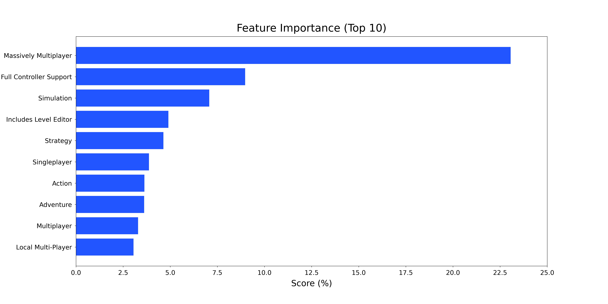

# Steam Games Analysis
**Authors:** [Vu Brown](https://www.linkedin.com/in/austin-brown-b5211384/)

## Overview
This project explores classification and machine learning algorithms in an effort to predict playerbase feedback of PC video games.

## Business Problem
This project assumes that I've been approached by a small, new video game studio currently in the pre-production, conceptualization phase of the game design process. The developers are certain that they want to make a game that will receive positive feedback from their playerbase. I've been tasked with providing data-driven recommendations for what type of PC video games receive positive reviews.

## The Data
This project uses the Steam games dataset, which can be found [here](https://www.kaggle.com/trolukovich/steam-games-complete-dataset), and this section explores the dataset.

## Data Cleaning
There are over 40,000 records in this dataset and 20 feature columnns. Unfortunately, almost all of these features are not useful in their current state. Data cleaning is going to VERY necessary, and is going to need to be VERY thorough.

This section follows how I went about creating a functioning dataset that is useful for predictive modeling. In particular, I discuss how I went about removing null-valued records, removing outliers in certain features, and determining non-video game related records/features.

Before data cleaning:
        ```
    RangeIndex: 40833 entries, 0 to 40832
    Data columns (total 20 columns):
     #   Column                    Non-Null Count  Dtype  
    ---  ------                    --------------  -----  
     0   url                       40833 non-null  object 
     1   types                     40831 non-null  object 
     2   name                      40817 non-null  object 
     3   desc_snippet              27612 non-null  object 
     4   recent_reviews            2706 non-null   object 
     5   all_reviews               28470 non-null  object 
     6   release_date              37654 non-null  object 
     7   developer                 40490 non-null  object 
     8   publisher                 35733 non-null  object 
     9   popular_tags              37888 non-null  object 
     10  game_details              40313 non-null  object 
     11  languages                 40797 non-null  object 
     12  achievements              12194 non-null  float64
     13  genre                     40395 non-null  object 
     14  game_description          37920 non-null  object 
     15  mature_content            2897 non-null   object 
     16  minimum_requirements      21069 non-null  object 
     17  recommended_requirements  21075 non-null  object 
     18  original_price            35522 non-null  object 
     19  discount_price            14543 non-null  object
     dtypes: float64(1), object(19)
    ```
    
After data cleaning:
    ```
    Int64Index: 11939 entries, 0 to 40811
    Data columns (total 27 columns):
     #   Column                      Non-Null Count  Dtype  
    ---  ------                      --------------  -----  
     0   positive_reviews            11939 non-null  int64  
     1   original_price_tuned        11939 non-null  float64
     2   Action                      11939 non-null  int64  
     3   Adventure                   11939 non-null  int64  
     4   Casual                      11939 non-null  int64  
     5   Early_Access                11939 non-null  int64  
     6   Indie                       11939 non-null  int64  
     7   Massively_Multiplayer       11939 non-null  int64  
     8   RPG                         11939 non-null  int64  
     9   Racing                      11939 non-null  int64  
     10  Simulation                  11939 non-null  int64  
     11  Sports                      11939 non-null  int64  
     12  Strategy                    11939 non-null  int64  
     13  Valve                       11939 non-null  int64  
     14  Co-op                       11939 non-null  int64  
     15  Cross-Platform_Multiplayer  11939 non-null  int64  
     16  Full_controller_support     11939 non-null  int64  
     17  In-App_Purchases            11939 non-null  int64  
     18  Includes_level_editor       11939 non-null  int64  
     19  Local_Co-op                 11939 non-null  int64  
     20  Local_Multi-Player          11939 non-null  int64  
     21  Multi-player                11939 non-null  int64  
     22  Online_Co-op                11939 non-null  int64  
     23  Online_Multi-Player         11939 non-null  int64  
     24  Partial_Controller_Support  11939 non-null  int64  
     25  Shared/Split_Screen         11939 non-null  int64  
     26  Single-player               11939 non-null  int64  
    dtypes: float64(1), int64(26)
    ```

## Predictive Modeling
This section will explore multiple classification and machine learning algorithms in an effort to find the most optimal model for predicting playerbase feedback.

These are the different models that I built and their corresponding accuracy scores:


Here are the top 10 features that contributed the most to the final model, XGBoost: 


## Conclusions
The final model, and frankly all of the other models, perform quite poorly. They will not be able to accurately determine what PC games will receive positive feedback.

This, however, does not mean that I should hang up the towel. This model does not have to be "final". There are still many other pathways to explore to try and produce a better model.

For one, I believe the biggest issue I have is that I have too many categorical features. I breifly discuss this in Appendix A, as I was beginning to experiment with merging some of the categorical features, in an attempt to reduce some of my categorical features and increase my accuracy scores. If I had even more time, I would explore the Steam Web API or other Steam games datasets on Kaggle and other data sources, and try to merge in more continuous features. In addition, there are plenty of other classification and machine learning algorithms that could be applied to my dataset that could yield a better predictive model.

This just all goes to show that there never really is a "final" model.

## Appendix A - Experimenting with Models after Feature Combination
After I produced a "final" model with XGBoost, I began to experiment with feature combination a bit, but I was not able to complete my experimentation. However, I decided to include my experimentation in this appendix in hopes that I will one day take a look at it again.

From my preliminary experiments, some of the models appear to be producing marginally better accuracy scores, but nothing significant.

## Appendix B - Plots for Presentation
All of the plots needed to be white.

## Appendix C - Extra Models
These models have been rendered useless since I learned about GridSearch. But they still show an interesting approach I took towards essentially creating a customized function that acted as a GridSearch for a KNN model.

## For More Information
Please review our full analysis in our [Jupyter Notebook](./main_notebook.ipynb) or [presentation deck](./presentation.pdf).

For additional questions, please contact [Vu](mailto:avbrown313@gmail.com).

## Repository Structure
```
├── README.md                           <- The top-level README for viewers of this repository
├── main_notebook.ipynb                 <- Narrative documentation of analysis performed in Jupyter Notebook
├── presentation.pdf                    <- PDF version of presentation to stakeholders
├── data                                <- Sourced externally from Kaggle
└── images                              <- Generated from Jupyter Notebook

```
